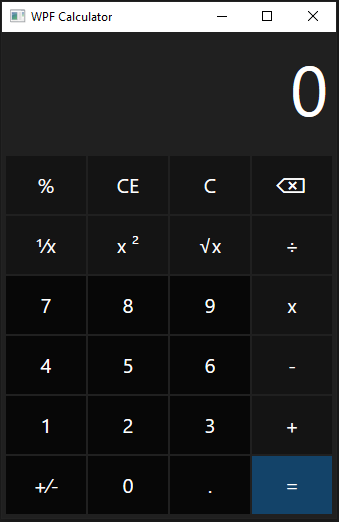

# WPF Calculator

## _Overview_

The WPF Calculator is a basic calculator application made with WPF. It performs basic calculations, and has styling similar to the Windows 10 Calculator application.

This application uses Microsoft's Windows Presentation Framework (WPF) and was written in C#/.NET.

### Features
- Basic Operations (+, -, *, /)
- Square and Square Root Calculations
- Percentage and Fraction Calculations

#### Development

This application was written in C#/.NET and was creating using the Microsoft Windows Presentation Foundation UI framework. Free use for everyone. MIT License.